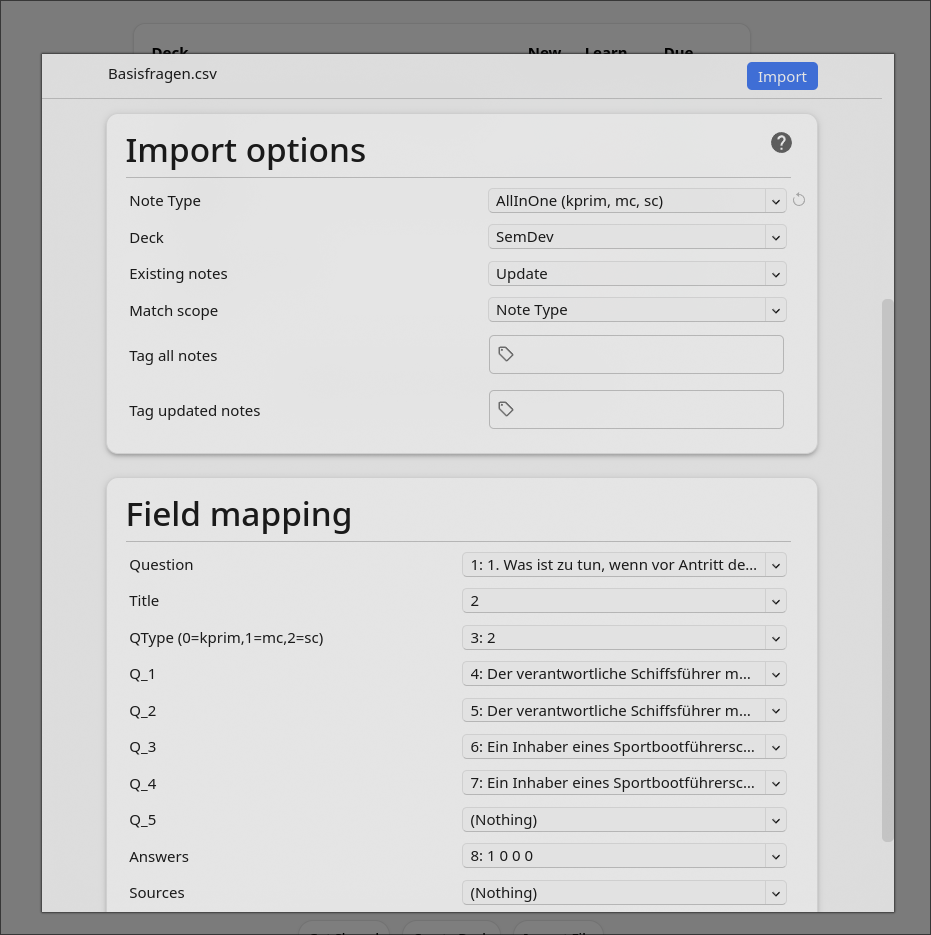

# ELWIS to Anki

Generate Anki flashcards from the official **ELWIS** Fragen- und Antwortenkatalog für den **Sportbootführerschein Binnen** (Binnenschifffahrtsstraßen, Germany) for personal study and offline use.

---

## Overview

This project parses locally saved HTML files of the official ELWIS questionnaire and converts the questions — including images — into a CSV file compatible with Anki.  

The main purpose is to **automate the creation of flashcards** for personal study, saving time and ensuring accuracy.  

**Note:** This version requires manual download of the website HTML.
---

## Features (Iteration 1)

- Parse questions and multiple-choice answers from ELWIS HTML files  
- Extract and save associated images  
- Generate a CSV file ready to import into Anki  
- Supports questions with multiple images per question  

---

## Getting Started

### 1. Download HTML files

1. Open the official ELWIS questionnaire page in your browser  
2. Press **Ctrl+S** (or Cmd+S on Mac) → “Webpage, Complete”  
3. Save the files in a dedicated folder, e.g., `html_docs/`  

---

### 2. Install dependencies

```bash
pip install -r requirements.txt
````

Dependencies:

* `beautifulsoup4`

---

### 3. Configure paths

In the script, set the following variables:

```python
output_folder = './out'
output_file = 'Spezifische_Segeln.csv'
html_file = './html_docs/ELWIS - Basisfragen.html'
```

---

### 4. Run the script

```bash
python main.py
```

The script will:

1. Parse the HTML file
2. Extract questions, answers, and images
3. Save images to your Anki media folder
    - on linux this is `$HOME/.local/share/Anki2/"Anki User"/collection.media/`
4. Create a CSV file ready for Anki import
    - its compatible with the [Multiple Choice for Anki](https://ankiweb.net/shared/info/1566095810) Addon
        - Anki Addon import code: 1566095810
    - import it like this



---

## Usage Notes

* **Images:** Currently, images are copied directly to the Anki media folder. Ensure the path is correct.
* **Personal use only:** The content is copyrighted by the official ELWIS questionnaire. This tool is intended solely for **personal study purposes**.

---

## Example

After running the script, your CSV will have lines like:

```
Question text<br>|Title|2|Answer1|Answer2|Answer3|Answer4|1 0 0 0
```

This can be imported directly into Anki.

---

## License / Disclaimer

This project is for **personal educational use only**. All questions and images belong to the official ELWIS sailing exam. The author does not claim ownership of the content.
